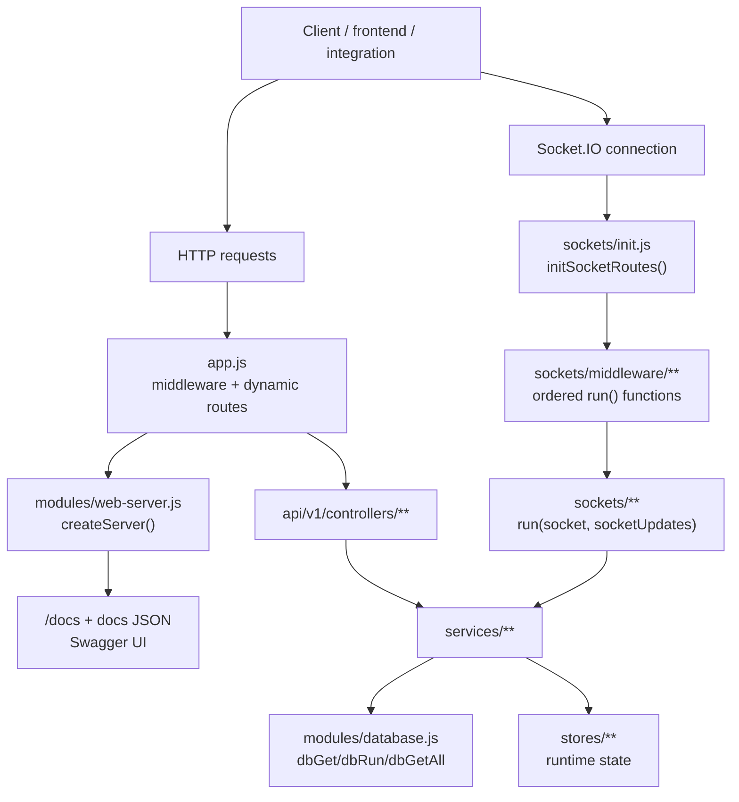
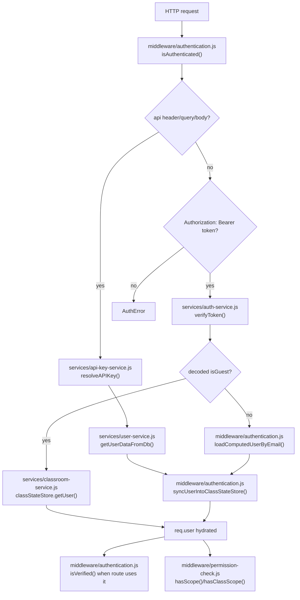
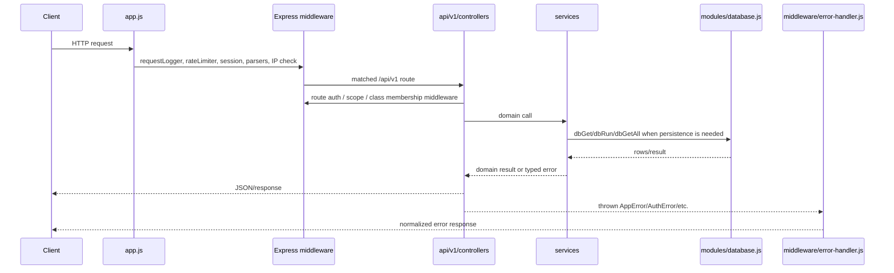
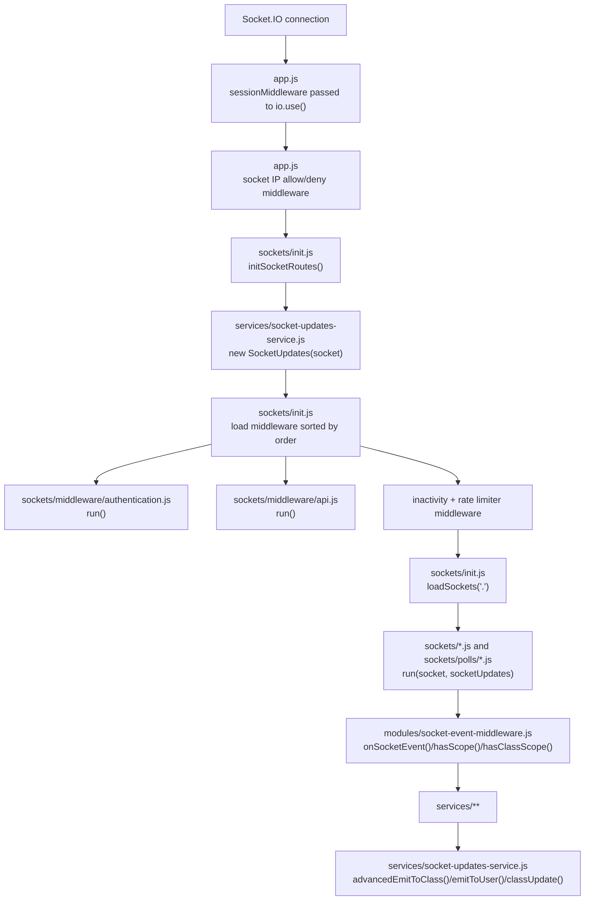
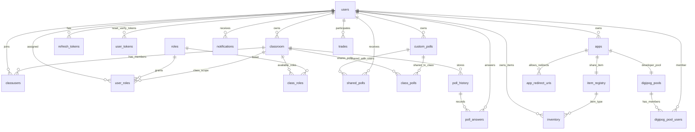
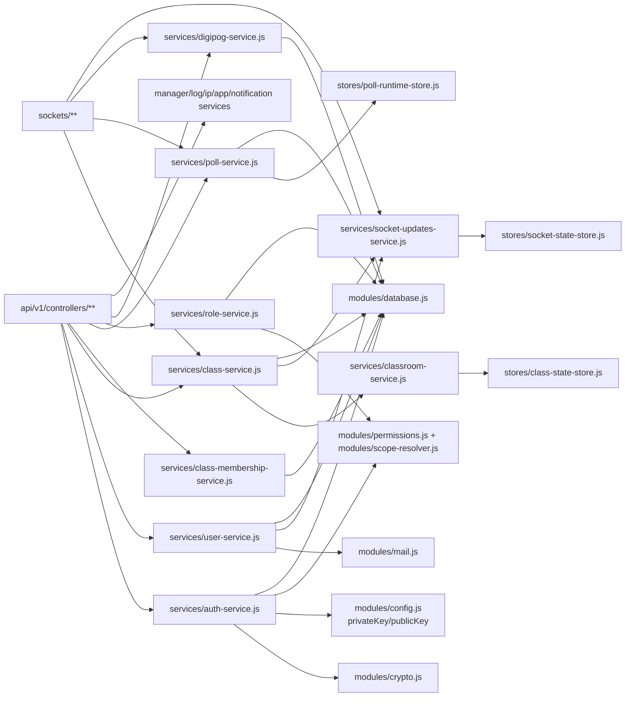

# Architecture Diagrams

When to read this: when you need a visual map of the running backend, auth behavior, request flow, sockets, data relationships, or service/module dependencies.

Back to: [Onboarding Home](./README.md)

Every diagram below is intentionally tied to filenames and functions. The database diagram shows conceptual relationships used by code and table columns; the current schema does not consistently declare SQLite foreign key constraints.

## Main Architecture

Sources: `app.js:getJSFiles`, route mounting loop in `app.js`, `modules/web-server.js:createServer`, `sockets/init.js:initSocketRoutes`, `modules/database.js:getDatabase`.

## Auth Flow

Sources: `middleware/authentication.js:isAuthenticated`, `isVerified`, `syncUserIntoClassStateStore`, `loadComputedUserByEmail`; `services/auth-service.js:verifyToken`; `services/api-key-service.js:resolveAPIKey`; `middleware/permission-check.js:hasScope`, `hasClassScope`.

Login and token issuance are handled separately by auth controllers calling `services/auth-service.js:register`, `login`, `refreshLogin`, `loginAsGuest`, `oidcOAuthLogin`, `generateAuthorizationCode`, `exchangeAuthorizationCodeForToken`, `exchangeRefreshTokenForAccessToken`, and `revokeOAuthToken`.

## HTTP Request Lifecycle

Sources: middleware order in `app.js`, dynamic controller loading in `app.js:getJSFiles`, database helpers in `modules/database.js`, error normalization in `middleware/error-handler.js`.

## Socket Flow

Sources: `app.js` Socket.IO `io.use` blocks, `sockets/init.js:initSocketRoutes`, `sockets/middleware/authentication.js:run`, `sockets/middleware/api.js:run`, `modules/socket-event-middleware.js:onSocketEvent`, `services/socket-updates-service.js:SocketUpdates`.

## Database Relationships

Standalone token-tracking table: `used_authorization_codes` records consumed OAuth authorization-code hashes and expiry times (source: `database/migrations/13_used_authorization_codes.sql`, `services/auth-service.js:exchangeAuthorizationCodeForToken`, `cleanupExpiredAuthorizationCodes`).

Sources: table definitions and migrations in `database/init.sql`, `database/migrations/*.sql`, and `database/migrations/JSMigrations/*.js`; runtime queries in `services/user-service.js`, `services/class-service.js`, `services/class-membership-service.js`, `services/role-service.js`, `services/poll-service.js`, `services/digipog-service.js`, `services/inventory-service.js`, `services/app-service.js`, and `services/notification-service.js`.

## Major Service And Module Dependencies

Sources: `require(...)` imports in `api/v1/controllers/**`, `sockets/**`, `services/auth-service.js`, `services/user-service.js`, `services/class-service.js`, `services/classroom-service.js`, `services/poll-service.js`, `services/role-service.js`, `services/socket-updates-service.js`, and `services/digipog-service.js`.
