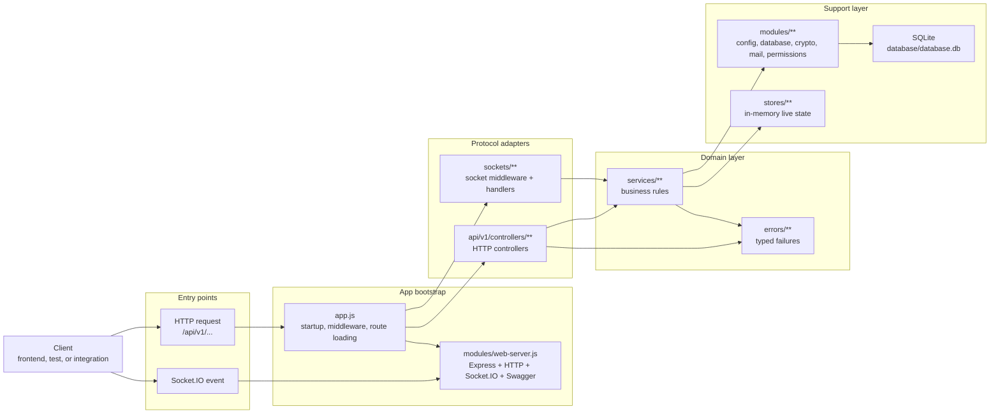
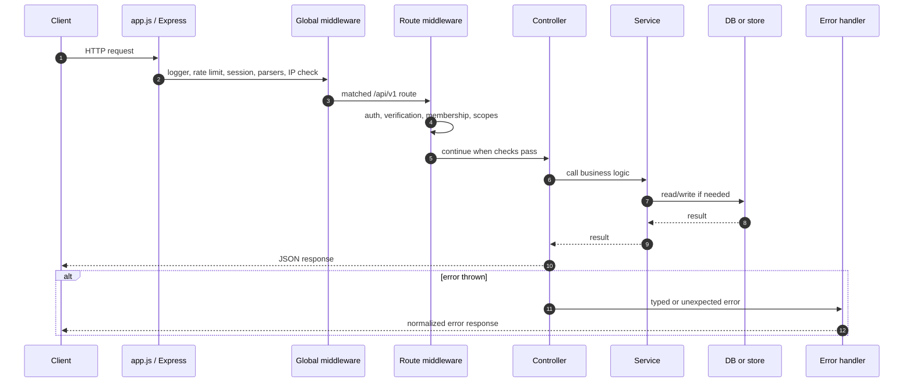
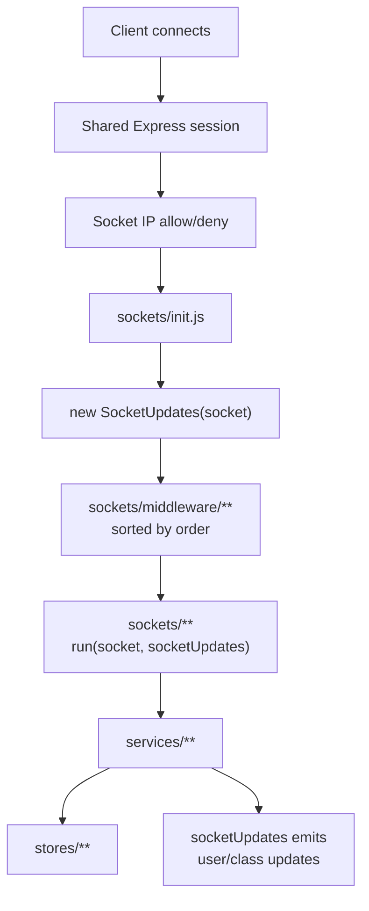
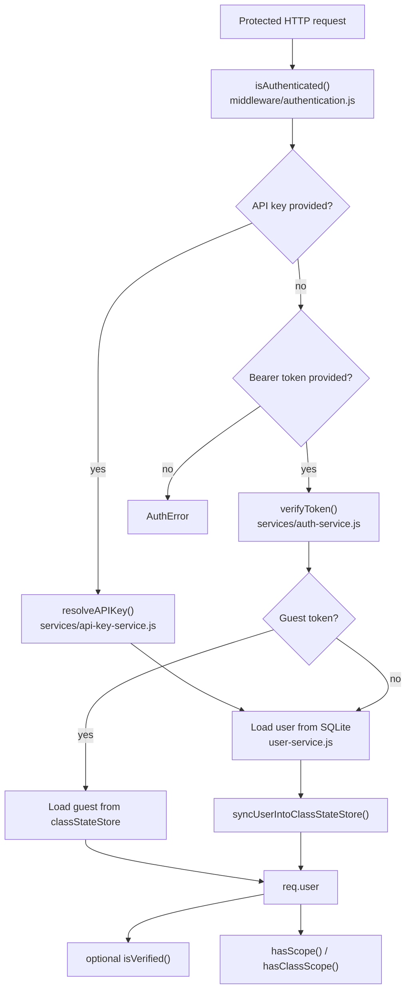
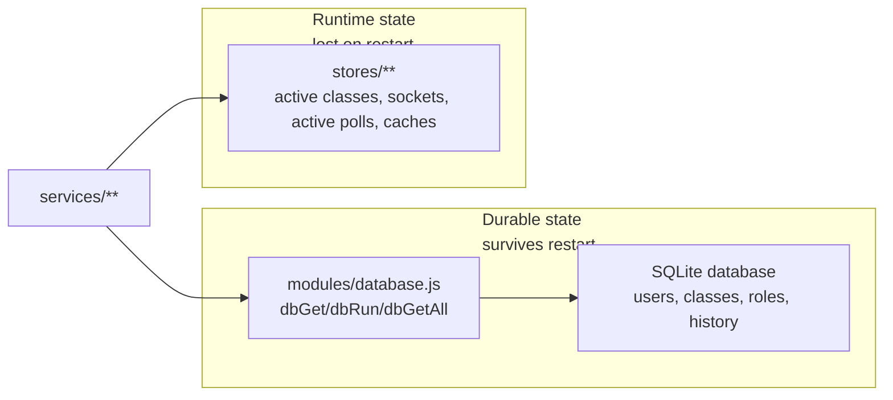
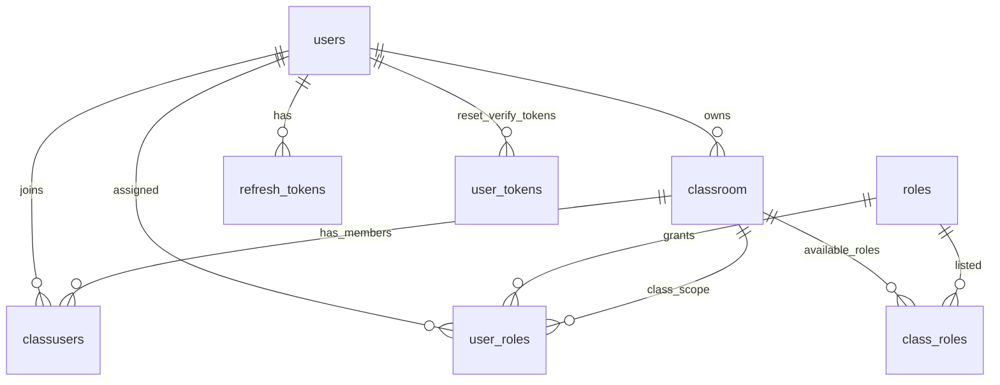
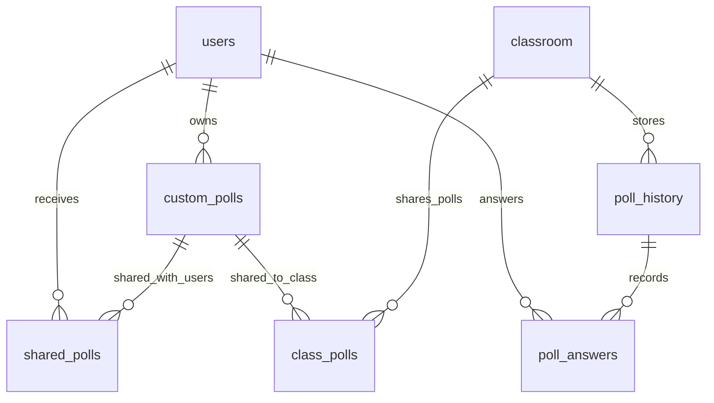
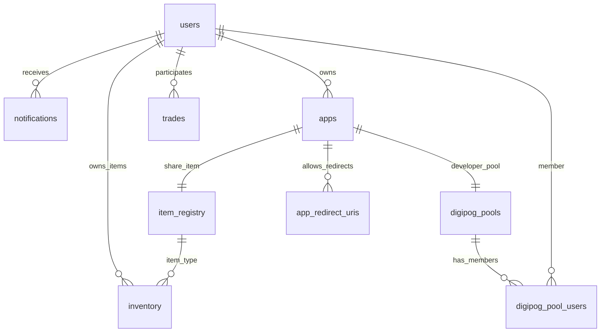
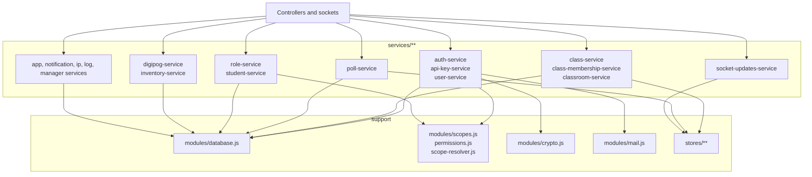

# Architecture Diagrams

Read this when a picture would help you understand how the backend fits together.

Back to: [Onboarding Home](./README.md)

These diagrams are intentionally beginner-friendly. They show dependency direction and runtime flow, not every function call.

## How To Read The Diagrams

- Boxes on the left are usually entry points.
- Boxes in the middle usually contain product behavior.
- Boxes on the right usually store data, emit updates, or provide infrastructure.
- Arrows mean "calls", "loads", or "depends on".

## Main Architecture

Beginner takeaway: controllers and sockets are entry points; services hold the real rules.

## HTTP Request Lifecycle

Beginner takeaway: a controller should not be doing heavy business logic. It should mostly translate HTTP into service calls.

## Socket Lifecycle

Beginner takeaway: if a socket event should change product state, make the socket handler call a service.

## Auth Flow

Beginner takeaway: protected routes usually get a `req.user` from either an API key or a bearer token, then route-specific middleware checks verification, class membership, and scopes.

## Persistence Vs Runtime State

Beginner takeaway: choose SQLite for data that must still exist tomorrow; choose stores for live state that can be rebuilt.

## Database Relationships

These are conceptual relationships used by the code. The SQLite schema does not always declare every relationship as a foreign key.

### Users, Classes, And Roles

### Polls

### Apps, Digipogs, Inventory, And Notifications

## Service Dependency Shape

Beginner takeaway: if you are unsure where to put a rule, start by looking for the closest service.
