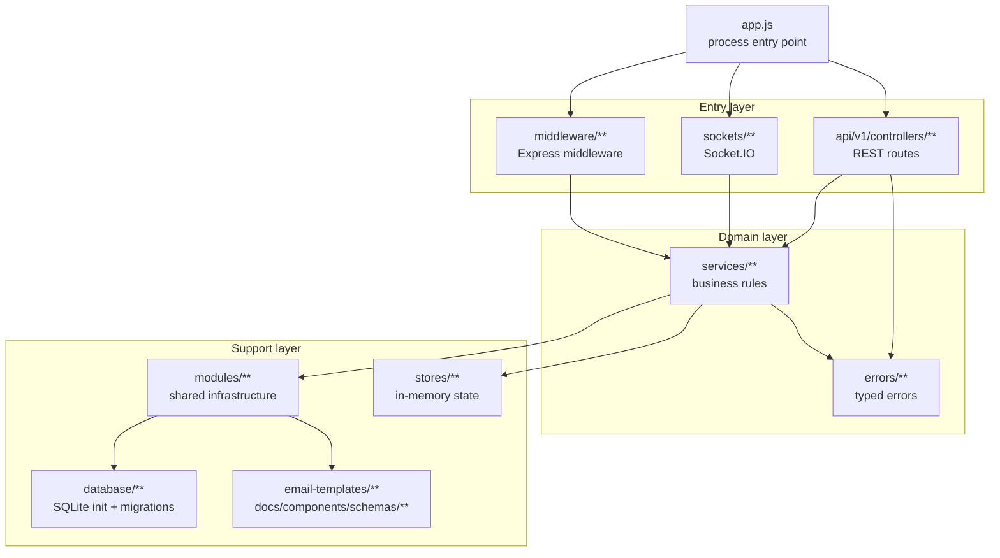

# Codebase Map

Read this when you want a detailed map of files and directories.

Back to: [Onboarding Home](./README.md)

For a shorter "where should I put my change?" guide, read [Project Map](./project-map.md).

## Runtime Layers

## Root Files

| File | Purpose |
|---|---|
| `app.js` | Starts the process, applies middleware, mounts routes, initializes sockets, starts listening |
| `package.json` | npm scripts, dependencies, module aliases |
| `package-lock.json` | Locked dependency versions |
| `jest.config.js` | Jest configuration |
| `jest.setup.js` | Test setup |
| `jsconfig.json` | Editor/module alias support |
| `.env-template` | Canonical local environment template |
| `.prettierrc` | Prettier configuration |
| `.gitignore` | Ignored local/generated files |
| `README.md` | Public project overview |
| `LICENSE`, `TERMS.md`, `PRIVACY.md` | Project legal docs |

## `api/v1/controllers/`

REST route modules. Each live route file exports a function that receives an Express router. `app.js` loads these files dynamically.

| Area | Files |
|---|---|
| Auth | `auth/register.js`, `auth/login.js`, `auth/refresh.js`, `auth/guest.js`, `auth/oidc/providers.js` |
| OAuth | `oauth/authorize.js`, `oauth/token.js`, `oauth/revoke.js` |
| Apps | `apps/register-app.js` |
| User profile and account | `user/user.js`, `user/me/me.js`, `user/me/password.js`, `user/delete.js`, `user/verify.js` |
| User roles and access | `user/perm.js`, `user/scopes.js`, `user/ban.js`, `user/api/regenerate.js` |
| User class/pool/transaction data | `user/class.js`, `user/classes.js`, `user/pools.js`, `user/transactions.js` |
| User PIN | `user/pin/pin.js`, `user/pin/reset.js`, `user/pin/verify.js` |
| Classes | `class/create.js`, `class/class.js`, `class/delete.js`, `class/start.js`, `class/end.js`, `class/active.js`, `class/settings.js` |
| Class membership | `class/enroll.js`, `class/join.js`, `class/leave.js`, `class/unenroll.js`, `class/kick.js`, `class/banned.js`, `class/students.js`, `class/regenerate-code.js` |
| Class polls | `class/polls/create.js`, `current.js`, `response.js`, `end.js`, `clear.js`, `polls.js` |
| Class breaks | `class/break/request.js`, `approve.js`, `deny.js`, `end.js` |
| Class help | `class/help/request.js`, `delete.js` |
| Class links | `class/links/add.js`, `change.js`, `links.js`, `remove.js` |
| Class roles | `class/roles/roles.js`, `class/roles/assign.js` |
| Class timer | `class/timer/start.js`, `pause.js`, `resume.js`, `end.js`, `clear.js`, `timer.js` |
| Digipogs | `digipogs/award.js`, `digipogs/transfer.js` |
| Pools | `pools/create.js`, `add-member.js`, `remove-member.js`, `payout.js`, `delete.js` |
| Notifications | `notifications/get-notifications.js`, `mark-notification-read.js`, `delete-notification.js` |
| System/admin | `config.js`, `certs.js`, `logs.js`, `ip.js`, `manager/manager.js`, `api-permission-check.js` |
| Example only | `controller-template.js` |

Tests for these routes live in `api/v1/controllers/tests/**`.

## `services/`

Business logic shared by controllers, sockets, tests, and startup.

| File | Responsibility |
|---|---|
| `api-key-service.js` | API key hashing, lookup, and cache behavior |
| `app-service.js` | External app registration, secrets, redirect URIs |
| `auth-service.js` | Register, login, JWTs, refresh, guest auth, OAuth token flow |
| `bootstrap-service.js` | Startup data seeding |
| `class-membership-service.js` | Enrollment, joins, leaves, kicks, bans |
| `class-service.js` | Class lifecycle, class settings, codes, timers, active state |
| `classroom-service.js` | Live class/user state wrappers around `class-state-store` |
| `digipog-service.js` | Transfers, awards, pools, payouts, transactions |
| `inventory-service.js` | Item registry and inventory |
| `ip-service.js` | IP allowlist/denylist persistence |
| `log-service.js` | Querying logs |
| `manager-service.js` | Manager/admin dashboard data |
| `notification-service.js` | Notifications |
| `poll-service.js` | Active polls, responses, saved polls, sharing, history |
| `role-service.js` | Global roles, class roles, scope assignment |
| `socket-updates-service.js` | `SocketUpdates` emit helpers |
| `student-service.js` | Student-shaped user/class data |
| `user-service.js` | User profile, verification, password, PIN, email |

Tests live in `services/tests/**`.

## `sockets/`

Socket.IO realtime layer.

| File | Responsibility |
|---|---|
| `init.js` | Loads socket middleware and event modules for each connection |
| `class.js` | Join/leave class rooms and class session realtime behavior |
| `user.js` | User socket events |
| `updates.js` | Class update events |
| `break.js` | Break realtime behavior |
| `help.js` | Help request realtime behavior |
| `digipogs.js` | Digipog realtime behavior |
| `backwards-compat.js` | Legacy socket aliases |
| `polls/poll-creation.js` | Create active poll |
| `polls/poll-response.js` | Submit poll response |
| `polls/update-poll.js` | Update active poll |
| `polls/save-poll.js` | Save poll template |
| `polls/share-poll.js` | Share poll |
| `polls/poll-removal.js` | Remove poll |

Socket middleware:

| File | Responsibility |
|---|---|
| `middleware/authentication.js` | Socket authentication |
| `middleware/api.js` | API socket compatibility |
| `middleware/inactivity.js` | Inactivity tracking |
| `middleware/rate-limiter.js` | Socket rate limiting |

Tests live in `sockets/tests/**`.

## `middleware/`

Express middleware used by HTTP requests.

| File | Responsibility |
|---|---|
| `request-logger.js` | Logs each request and attaches request logging helpers |
| `rate-limiter.js` | Request rate limiting |
| `parse-json.js` | JSON parsing helper for routes that need explicit parsing |
| `authentication.js` | API key/JWT auth, email verification, IP allow/deny cache |
| `permission-check.js` | Scope and class membership middleware |
| `error-handler.js` | Converts thrown errors into JSON responses |

Tests live in `middleware/tests/**`.

## `modules/`

Shared infrastructure and utilities.

| File | Responsibility |
|---|---|
| `web-server.js` | Creates Express, HTTP, Socket.IO, and Swagger docs |
| `config.js` | Reads env settings, creates `.env`, loads/generates RSA keys |
| `database.js` | SQLite helpers: `dbGet`, `dbRun`, `dbGetAll` |
| `crypto.js` | Hashing and comparison helpers |
| `mail.js` | Renders and sends email |
| `oidc.js` | OIDC provider setup |
| `logger.js` | Winston logger setup |
| `permissions.js` | Permission summaries from scopes |
| `scopes.js` | Scope constants |
| `scope-resolver.js` | Effective scope resolution |
| `roles.js` | Role helpers |
| `role-reference.js` | Role reference data |
| `socket-event-middleware.js` | Socket event guards and wrappers |
| `socket-error-handler.js` | Socket error formatting |
| `pagination.js` | Pagination helpers |
| `proxy-trust.js` | Express proxy trust parsing |
| `password-validation.js` | Password rules |
| `pin-validation.js` | PIN rules |
| `digipog-transfer.js` | Digipog transfer calculation |
| `error-wrapper.js` | Async route wrapper |
| `util.js` | General helpers |

Tests live in `modules/tests/**`.

Shared test helpers live in `modules/test-helpers/**`.

## `stores/`

In-memory state. Data here is lost on restart.

| File | Holds |
|---|---|
| `class-state-store.js` | Live class and user state |
| `poll-runtime-store.js` | Active poll state and answers |
| `socket-state-store.js` | Connected sockets and last activity |
| `class-code-cache-store.js` | Class code to class ID cache |
| `api-key-cache-store.js` | API key lookup cache |

## `database/`

SQLite setup and migration history.

| File Or Folder | Responsibility |
|---|---|
| `init.sql` | Base schema for new local DBs |
| `init.js` | Creates `database/database.db` and runs migrations |
| `migrate.js` | Runs all migrations |
| `items.csv` | Item seed/source data used by item migration logic |
| `modules/crypto.js` | Legacy crypto helper used by old migration code |
| `migrations/*.sql` | SQL migrations |
| `migrations/JSMigrations/*.js` | JS migrations |

Do not edit `init.sql` or old migrations for new schema work.

## `errors/`

Typed error classes:

- `app-error.js`
- `auth-error.js`
- `conflict-error.js`
- `forbidden-error.js`
- `not-found-error.js`
- `rate-limit-error.js`
- `validation-error.js`

Throw these from services and controllers so `middleware/error-handler.js` can return consistent HTTP errors.

## Supporting Docs And Assets

| Path | Purpose |
|---|---|
| `email-templates/password-reset.hbs` | Password reset email |
| `email-templates/pin-reset.hbs` | PIN reset email |
| `email-templates/verify-email.hbs` | Email verification email |
| `docs/components/schemas/Class.yaml` | OpenAPI class schema |
| `docs/components/schemas/Error.yaml` | OpenAPI error schema |
| `docs/components/schemas/Notification.yaml` | OpenAPI notification schema |
| `docs/components/schemas/Permission.yaml` | OpenAPI permission schema |
| `docs/components/schemas/User.yaml` | OpenAPI user schema |

## Test Inventory

| Location | Covers |
|---|---|
| `api/v1/controllers/tests/*.spec.js` | REST endpoint behavior |
| `services/tests/*.spec.js` | Service behavior |
| `sockets/tests/*.spec.js` | Socket behavior |
| `middleware/tests/*.spec.js` | Middleware behavior |
| `modules/tests/*.spec.js` | Shared module behavior |
| `modules/test-helpers/db.js` | Test DB helpers |
| `modules/test-helpers/test-schema.sql` | Test DB schema |
| `modules/test-helpers/role-seeding.js` | Test role seed helpers |

## Quick Ownership Guide

| If You See A Bug In... | Look First In... |
|---|---|
| Login or refresh | `services/auth-service.js`, `middleware/authentication.js` |
| API key access | `services/api-key-service.js` |
| A REST endpoint | Matching file under `api/v1/controllers/**`, then the service it calls |
| A socket event | Matching file under `sockets/**`, then the service it calls |
| Class membership | `services/class-membership-service.js` |
| Class state after restart | `services/class-service.js`, `stores/class-state-store.js`, database queries |
| Poll responses | `services/poll-service.js`, `sockets/polls/**`, class poll controllers |
| Role/scopes | `services/role-service.js`, `modules/scopes.js`, `modules/scope-resolver.js` |
| Email | `modules/mail.js`, `email-templates/**`, `services/user-service.js` |
| Swagger docs | Controller JSDoc, `docs/components/schemas/**`, `modules/web-server.js` |
