# Codebase Map

When to read this: when you want to see every source directory and file in one place, or understand how a specific piece fits into the whole project.

Back to: [Onboarding Home](./README.md)

---

## Full Codebase Flowchart

Every major directory and its key files. Arrows show the primary dependency direction.

```mermaid
flowchart TB
    AppJS["**app.js**\nProcess entry point\nMiddleware · route mounting · socket init · listen"]

    subgraph Modules ["modules/ — shared infrastructure"]
        WebServer["web-server.js\nExpress app · HTTP server\nSocket.IO · Swagger/OpenAPI"]
        Config["config.js\nenv loading · RSA key gen\nrate-limit · port config"]
        DB["database.js\ndbGet · dbRun · dbGetAll\nSQLite wrapper"]
        Crypto["crypto.js\nhashing · signing helpers"]
        Mail["mail.js\nHandlebars email renderer\nSMTP dispatch"]
        OIDCMod["oidc.js\nOIDC provider init\nGoogle · Microsoft"]
        Logger["logger.js\nWinston logger"]
        Perms["permissions.js\nscopes.js\nscope-resolver.js\nrole-reference.js\nroles.js"]
        SocketEvtMW["socket-event-middleware.js\nonSocketEvent · hasScope · hasClassScope"]
        Misc["util.js · pagination.js · proxy-trust.js\npin-validation.js · password-validation.js\ndigipog-transfer.js · error-wrapper.js"]
    end

    subgraph DBLayer ["database/ — persistence bootstrap"]
        InitJS["init.js\ninitializeDatabase()"]
        MigrateJS["migrate.js\nexecuteMigration()"]
        InitSQL["init.sql\nbase schema — do not edit"]
        SQLMigs["migrations/*.sql\nsequential SQL migrations"]
        JSMigs["migrations/JSMigrations/*.js\ndata/logic migrations"]
    end

    subgraph HTTPMiddleware ["middleware/ — Express middleware chain"]
        AuthMW["authentication.js\nisAuthenticated · isVerified\nisIPBanned · refreshIPAccessCache\nsyncUserIntoClassStateStore"]
        PermCheck["permission-check.js\nhasScope · hasClassScope"]
        RateLim["rate-limiter.js"]
        ReqLog["request-logger.js"]
        ParseJSON["parse-json.js"]
        ErrHandler["error-handler.js\nnormalizes all thrown errors"]
    end

    subgraph Errors ["errors/ — typed error classes"]
        AppError["app-error.js"]
        AuthError["auth-error.js"]
        ValError["validation-error.js"]
        ForbidError["forbidden-error.js"]
        NotFound["not-found-error.js"]
        Conflict["conflict-error.js"]
        RateLimitErr["rate-limit-error.js"]
    end

    subgraph Controllers ["api/v1/controllers/ — REST endpoints"]
        AuthCtrl["auth/**\nregister · login · refresh\nguest · OIDC providers/callbacks"]
        OAuthCtrl["oauth/**\nauthorize · token exchange\nrefresh · revoke"]
        UserCtrl["user/**\nprofile · verify · password\nPIN · API key · ban/unban · delete"]
        ClassCtrl["class/**\ncreate · enroll · join/leave\nstart/end · settings · student list"]
        ClassTools["class/polls · break · help\ntimer · links · roles"]
        DigipogCtrl["digipogs/** · pools/**\ntransfers · awards · pool membership · payout"]
        AdminCtrl["config · certs · logs · ip\nmanager · notifications · apps"]
    end

    subgraph Services ["services/ — domain and business logic"]
        AuthSvc["auth-service.js\nregister · login · token issuance\nOAuth · OIDC · API keys"]
        UserSvc["user-service.js\nprofile · verification · password\nPIN · email dispatch"]
        ClassSvc["class-service.js\ncreate · join · start/end\nsettings · code management"]
        MemberSvc["class-membership-service.js\nenroll · kick · ban"]
        PollSvc["poll-service.js\ncreate · respond · share\nhistory · runtime state"]
        RoleSvc["role-service.js\nassign · resolve · class roles"]
        DigipogSvc["digipog-service.js\ntransfer · award · pools"]
        InventorySvc["inventory-service.js\nitems · item registry"]
        NotifSvc["notification-service.js"]
        AppSvc["app-service.js\nOAuth app registration"]
        ClassroomSvc["classroom-service.js\nclassStateStore management"]
        SocketUpdatesSvc["socket-updates-service.js\nSocketUpdates class\nadvancedEmitToClass · emitToUser · classUpdate"]
        ApiKeySvc["api-key-service.js\nresolveAPIKey · cache"]
        BootstrapSvc["bootstrap-service.js\nensureFormbarDeveloperPool"]
        IpSvc["ip-service.js"]
        LogSvc["log-service.js"]
        ManagerSvc["manager-service.js"]
        StudentSvc["student-service.js"]
    end

    subgraph SocketLayer ["sockets/ — Socket.IO real-time layer"]
        SocketInit["init.js\ninitSocketRoutes()\nloads middleware then event modules"]
        subgraph SocketMWGroup ["sockets/middleware/"]
            SockAuthMW["authentication.js  run()"]
            SockApiMW["api.js  run()"]
            SockRateLim["rate-limiter.js  run()"]
            SockInact["inactivity.js  run()"]
        end
        subgraph SocketHandlers ["sockets/ event handlers"]
            SockClass["class.js\njoin · leave · rooms"]
            SockUser["user.js · updates.js"]
            SockBreak["break.js · help.js"]
            SockDigi["digipogs.js"]
            SockPolls["polls/poll-creation.js\npolls/poll-response.js\npolls/update-poll.js\npolls/save-poll.js\npolls/share-poll.js\npolls/poll-removal.js"]
            SockCompat["backwards-compat.js\nlegacy event aliases"]
        end
    end

    subgraph Stores ["stores/ — in-memory runtime state"]
        ClassStore["class-state-store.js\nlive class/session state"]
        PollStore["poll-runtime-store.js\nactive poll runtime"]
        SockStore["socket-state-store.js\nconnected socket tracking"]
        CodeCache["class-code-cache-store.js"]
        KeyCache["api-key-cache-store.js"]
    end

    subgraph Assets ["static assets"]
        EmailTpls["email-templates/\nHandlebars templates\naccount · password · PIN"]
        OpenAPISchemas["docs/components/schemas/\nOpenAPI YAML components"]
    end

    %% Entry point wiring
    AppJS --> WebServer
    AppJS --> Config
    AppJS --> InitJS
    AppJS --> HTTPMiddleware
    AppJS --> Controllers
    AppJS --> SocketInit

    %% Database bootstrap
    InitJS --> InitSQL
    InitJS --> MigrateJS
    MigrateJS --> SQLMigs
    MigrateJS --> JSMigs

    %% HTTP layer
    Controllers --> HTTPMiddleware
    Controllers --> Services
    Controllers --> Errors
    HTTPMiddleware --> Perms
    ErrHandler --> Errors

    %% Socket layer
    SocketInit --> SocketMWGroup
    SocketInit --> SocketHandlers
    SocketHandlers --> Services
    SocketHandlers --> SocketEvtMW
    SocketEvtMW --> Perms

    %% Service layer
    Services --> DB
    Services --> Stores
    AuthSvc --> Crypto
    AuthSvc --> OIDCMod
    AuthSvc --> Perms
    UserSvc --> Mail
    ClassroomSvc --> ClassStore
    SocketUpdatesSvc --> SockStore
    PollSvc --> PollStore

    %% Infrastructure
    DB --> DBLayer
    Mail --> EmailTpls
    WebServer --> OpenAPISchemas
    WebServer --> Logger
    AppJS --> Logger
```

---

## Directory and File Inventory

### Root

| File | Purpose |
|---|---|
| `app.js` | Process entry point. Wires all middleware, routes, sockets, and starts the HTTP listener. |
| `jest.config.js` / `jest.setup.js` | Test runner configuration and global setup. |
| `package.json` | Dependency list, `scripts` (dev, test, migrate, init-db, format). |
| `.env-template` | Canonical list of all environment variables. Copy to `.env` to configure. |

---

### `api/v1/controllers/`

Versioned REST route handlers. Each file exports a registration function loaded by `app.js`. Skips files named `*.spec.js` and `controller-template.js`.

| Route group | Directory |
|---|---|
| Auth (register, login, refresh, guest, OIDC) | `auth/` |
| OAuth (authorize, token, refresh, revoke) | `oauth/` |
| Users (profile, verify, password, PIN, API key, ban) | `user/` |
| Classes (create, enroll, join, start/end, settings) | `class/` |
| Class tools (polls, break, help, timer, links, roles) | `class/polls/` `class/break/` etc. |
| Digipogs and pools | `digipogs/` `pools/` |
| System/admin | `config.js` `logs.js` `ip.js` `manager/` `notifications/` `apps/` |

---

### `services/`

All domain and business logic. Called by controllers, socket handlers, and tests. Do not call `modules/database.js` directly from a controller — route through a service.

| File | Responsibility |
|---|---|
| `auth-service.js` | Registration, login, tokens, refresh, OAuth/OIDC flows |
| `user-service.js` | Profile, verification, password, PIN, email |
| `class-service.js` | Class lifecycle, join/leave, settings, codes |
| `class-membership-service.js` | Enroll, kick, ban |
| `classroom-service.js` | `classStateStore` CRUD for live session state |
| `poll-service.js` | Poll create/respond/share/history, runtime store |
| `role-service.js` | Role assignment, resolution, class roles |
| `digipog-service.js` | Digipog transfers, awards, pools |
| `inventory-service.js` | Items and item registry |
| `notification-service.js` | User notifications |
| `app-service.js` | OAuth app registration and lookup |
| `socket-updates-service.js` | `SocketUpdates` class — all emit helpers |
| `api-key-service.js` | API key resolution and caching |
| `bootstrap-service.js` | Startup-time data seeding |
| `ip-service.js` | IP allowlist/denylist management |
| `log-service.js` | Log query helpers |
| `manager-service.js` | Admin dashboard data |
| `student-service.js` | Student-specific queries |

---

### `sockets/`

Real-time Socket.IO layer. `init.js` loads `sockets/middleware/` by `order` value, then all `*.js` files recursively (skipping `init.js`, `middleware/`, and `tests/`). Every event module must export `run(socket, socketUpdates)`.

| File | Events handled |
|---|---|
| `class.js` | Join/leave class, room management |
| `user.js` | User-level socket events |
| `updates.js` | Class state update pushes |
| `break.js` | Break flow |
| `help.js` | Help request flow |
| `digipogs.js` | Digipog socket events |
| `backwards-compat.js` | Legacy event name aliases |
| `polls/poll-creation.js` | Create poll |
| `polls/poll-response.js` | Submit poll response |
| `polls/update-poll.js` | Update active poll |
| `polls/save-poll.js` | Save custom poll |
| `polls/share-poll.js` | Share poll to class |
| `polls/poll-removal.js` | Remove poll |

Socket middleware runs first in sorted `order`:

| File | Role |
|---|---|
| `middleware/authentication.js` | Authenticate socket user |
| `middleware/api.js` | API socket compatibility |
| `middleware/rate-limiter.js` | Per-socket rate limiting |
| `middleware/inactivity.js` | Inactivity tracking |

---

### `middleware/`

Express middleware applied globally in `app.js`. Order matters: logger → rate limiter → session → parsers → IP check → routes → 404 → error handler.

| File | Role |
|---|---|
| `request-logger.js` | Per-request logging |
| `rate-limiter.js` | IP/user rate limiting |
| `parse-json.js` | Body parsing |
| `authentication.js` | Token/API key auth, `req.user` hydration |
| `permission-check.js` | `hasScope()`, `hasClassScope()` |
| `error-handler.js` | Normalize all thrown errors to JSON |

---

### `modules/`

Shared infrastructure. Never contains domain business logic — that lives in `services/`.

| File | Role |
|---|---|
| `web-server.js` | Creates Express + HTTP + Socket.IO + Swagger |
| `config.js` | Reads `.env`, generates RSA keys, exposes `settings` |
| `database.js` | `dbGet`, `dbRun`, `dbGetAll` — all SQLite access |
| `crypto.js` | Hashing, comparison helpers |
| `mail.js` | Renders Handlebars templates and dispatches email |
| `oidc.js` | OIDC provider initialization |
| `logger.js` | Winston-based logger |
| `permissions.js` | Scope-to-permission-level mapping |
| `scopes.js` | Scope string constants |
| `scope-resolver.js` | Effective scope resolution for a user |
| `roles.js` / `role-reference.js` | Global and class role definitions |
| `socket-event-middleware.js` | `onSocketEvent()`, socket-level `hasScope()` |
| `util.js` | General-purpose helpers |
| `pagination.js` | Pagination helpers |
| `proxy-trust.js` | Express proxy trust configuration |
| `pin-validation.js` | PIN format rules |
| `password-validation.js` | Password format rules |
| `digipog-transfer.js` | Digipog transfer computation |
| `error-wrapper.js` | Wraps async route handlers |

---

### `stores/`

In-memory caches. Data here does not survive process restart. If state must survive restart, it belongs in the database.

| File | What it holds |
|---|---|
| `class-state-store.js` | Live class/session objects |
| `poll-runtime-store.js` | Active poll state and answers |
| `socket-state-store.js` | Active socket connections |
| `class-code-cache-store.js` | Class code → class ID mapping |
| `api-key-cache-store.js` | API key → user cache |

---

### `database/`

| File/Directory | Role |
|---|---|
| `init.sql` | Base schema. **Do not edit.** |
| `init.js` | Creates `database.db` from `init.sql` and runs migrations |
| `migrate.js` | Collects and applies `.sql` and `.js` migrations in filename order |
| `migrations/*.sql` | SQL DDL/DML migration history |
| `migrations/JSMigrations/*.js` | Data or logic migrations in JavaScript |

---

### `errors/`

Typed error classes consumed by `middleware/error-handler.js`. Throw these from services and controllers rather than raw `Error` objects.

`AppError` · `AuthError` · `ValidationError` · `ForbiddenError` · `NotFoundError` · `ConflictError` · `RateLimitError`

---

### `email-templates/`

Handlebars templates rendered by `modules/mail.js`. One template per email type (account verification, password reset, PIN reset/verify).

---

### `docs/components/schemas/`

OpenAPI YAML schema components. Referenced by JSDoc annotations in controllers and loaded by `modules/web-server.js` when building the Swagger UI at `/docs`.

---

### `tests/`

Tests are co-located with the code they cover:

| Test location | What it covers |
|---|---|
| `api/v1/controllers/tests/*.spec.js` | REST endpoint behavior |
| `services/tests/*.spec.js` | Service-layer logic |
| `sockets/tests/*.spec.js` | Socket event handling |
| `middleware/tests/*.spec.js` | Middleware behavior |
| `modules/tests/*.spec.js` | Module utilities |
| `modules/test-helpers/` | Shared Supertest app factory, test DB schema, request helpers |
